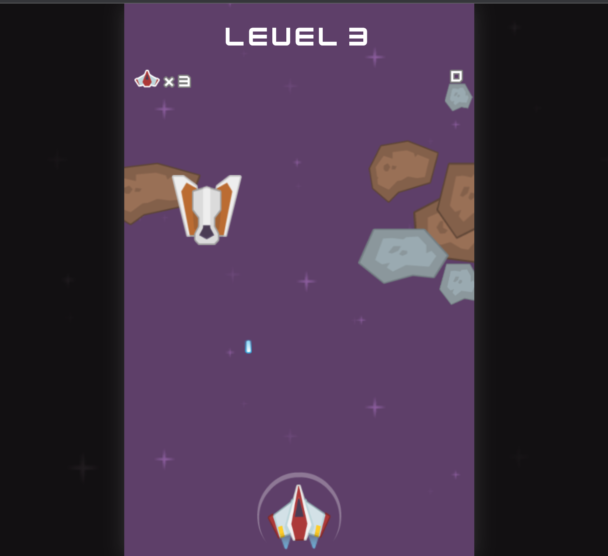
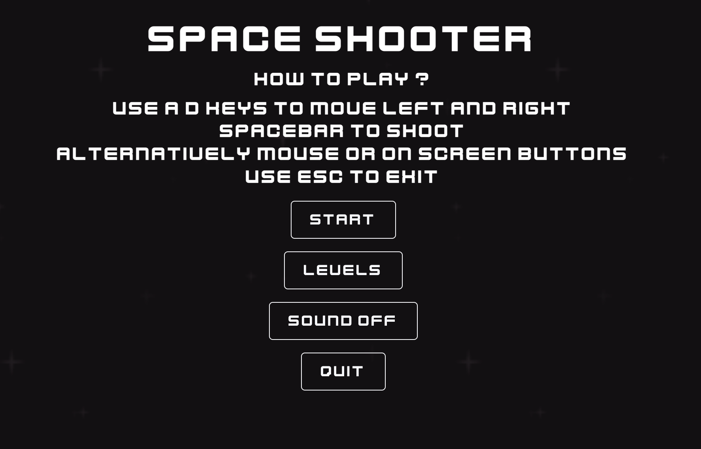
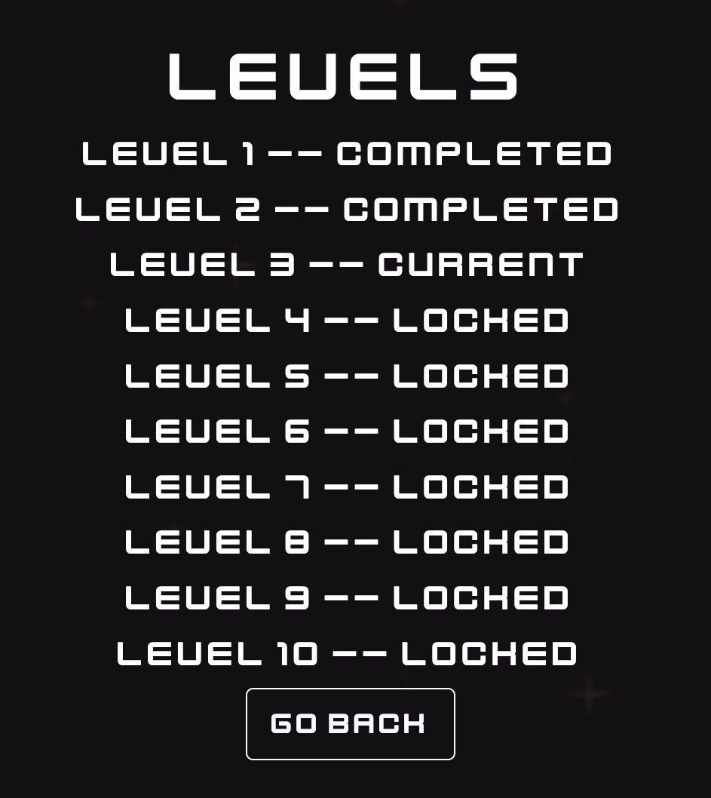
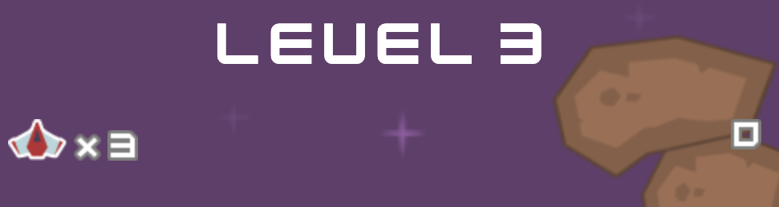
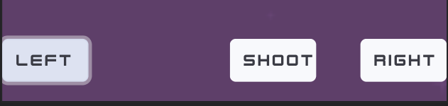

# Space Shooter 

## Welcome to the site of the best retro game 

Space Shooter game was made as project to learn and develop JavaScript skills. The purpose of the game is to destroy enemies ships and avoid objects flying into players direction like meteors or enemy missiles. Game should entertain the user with attractive design and 10 levels to accomplish where difficulty will progressively increase.

## Features

Space Shooter game have a number of features to help gamer stayed entertained and provide informations about current progress.
 
#### 1. Main Menu     
  * Provides clear informations about the game controls and how to use them. 
  * Mouse pointer in Main Menu is represented as a space ship to build an excitement of upcoming adventure and enhance user experience.
  

 

#### 2. The levels page
  * Informs player about the progress in the clear and understandable way.
   

#### 3.  Sound Button
  * Give player an option to disable sound effects. 

#### 4. In Game Information Bar
  * Status bar displayed in the top of the game screen provides vital informations for the player.
  * Number of lifes left.
  * Number of points scored
  * Current level
  

#### 5. On Screen Buttons  
  * TTo improve user experience on mobile devices and facilitate easy movement of spaceship, game will display on screen buttons like Left, Right and Shoot. 
  *

## Testing 
  Extensive testing was employed to ensure responsiveness of Space Sooter game at all the devices. During that process a number of minor bug was eliminated like:
   * On screen buttons no responding. 
   * No validation of display port to change screen size.  
  
### Validator Testing 
  1. HTML - minor errors and warnings returned, type=text/javascript warning to be fixed shortly but do to deadline ignored for now. IMG errors ignored due to the JavaSript nature of the porject, will be eplored in futre. All the rest passed though the official [W3C validator](https://validator.w3.org/nu/?doc=https%3A%2F%2Fmr-pete.github.io%2FSpace-Shooter%2F)
  2. CSS - no errors returned, all passed through [Jigsaw validator](https://jigsaw.w3.org/css-validator/validator?uri=https%3A%2F%2Fmr-pete.github.io%2FSpace-Shooter%2F&profile=css3svg&usermedium=all&warning=1&vextwarning=&lang=pl-PL)

## Deployment
  Space Ship was deployed to GitHub pages by the standard steps including:
    * Navigation to settings in the GitHub repository and Pages section
    * Selection of Main Branch from drop-down source menu.
 The live link to the website - https://mr-pete.github.io/Space-Shooter/
 
 ## Credits
 
 ### Content
  * The game inspiration was taken from [Google I/O 2011](https://www.youtube.com/watch?v=yEocRtn_j9s)
  * The instruction on how to build a game engine were taken from [Seth Ladd's Blog](http://blog.sethladd.com/2011/05/source-code-slides-and-video-for-html5.html)
  * The pointer and icons were taken from [Noun Project](https://thenounproject.com/)
 
 ### Media
  * The png files were sourced from [pikpng](https://www.pikpng.com/) and [kindpng](https://www.kindpng.com/)
  * Game sound effects were downloaded from [mixkit](https://mixkit.co/free-sound-effects/game/)
  
